Visualization
================

<https://github.com/maurolepore/2020-05-12-open-science-with-r>

## Setup

The setup chunk always runs before anything else.

  - Use tidyverse package.

<!-- end list -->

``` r
# install.packages("tidyverse")
library(tidyverse)
#> ── Attaching packages ──────────────────────────────────────────────── tidyverse 1.3.0 ──
#> ✓ ggplot2 3.3.0           ✓ purrr   0.3.4      
#> ✓ tibble  3.0.1           ✓ dplyr   0.8.99.9002
#> ✓ tidyr   1.0.2           ✓ stringr 1.4.0      
#> ✓ readr   1.3.1           ✓ forcats 0.5.0
#> ── Conflicts ─────────────────────────────────────────────────── tidyverse_conflicts() ──
#> x dplyr::filter() masks stats::filter()
#> x dplyr::lag()    masks stats::lag()
```

Bored?

  - Why did I comment the the call to “install.packages()”?
  - Hint: Is it polite to force-install software in someone else’s
    computer?

## Warm up

  - Explore <https://ggplot2.tidyverse.org/>
  - Plot what you see in Usage.

<!-- end list -->

``` r
library(ggplot2)

ggplot(mpg, aes(displ, hwy, colour = class)) +
  geom_point()
```

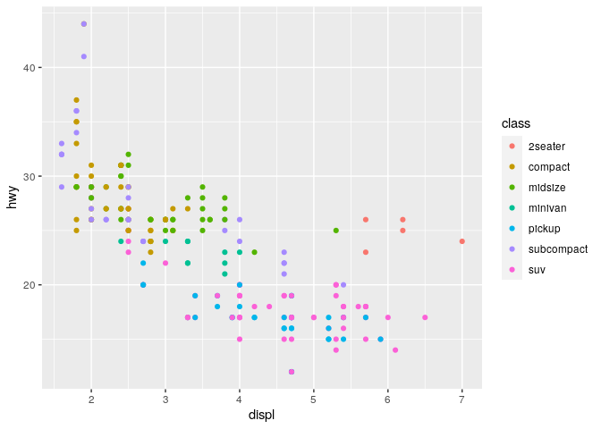<!-- -->

## Data

  - Read the .csv file at <https://bit.ly/03-data-ca>

<!-- end list -->

``` r
# National Parks in California
ca <- readr::read_csv("https://bit.ly/03-data-ca")
#> Parsed with column specification:
#> cols(
#>   region = col_character(),
#>   state = col_character(),
#>   code = col_character(),
#>   park_name = col_character(),
#>   type = col_character(),
#>   visitors = col_double(),
#>   year = col_double()
#> )
```

Bored?

  - How would you write `ca` to the file “data/03-data-ca.csv”?
  - How would you re-read it from “data/03-data-ca.csv”?

Copy-paste from the code to read all other files.

``` r
# Acadia National Park
acadia <- read_csv("https://bit.ly/03-data-acadia")
#> Parsed with column specification:
#> cols(
#>   region = col_character(),
#>   state = col_character(),
#>   code = col_character(),
#>   park_name = col_character(),
#>   type = col_character(),
#>   visitors = col_double(),
#>   year = col_double()
#> )
# Southeast US National Parks
se <- read_csv("https://bit.ly/03-data-se")
#> Parsed with column specification:
#> cols(
#>   region = col_character(),
#>   state = col_character(),
#>   code = col_character(),
#>   park_name = col_character(),
#>   type = col_character(),
#>   visitors = col_double(),
#>   year = col_double()
#> )
# 2016 Visitation for all Pacific West National Parks
visit_16 <- read_csv("https://bit.ly/03-data-visit-16")
#> Parsed with column specification:
#> cols(
#>   region = col_character(),
#>   state = col_character(),
#>   code = col_character(),
#>   park_name = col_character(),
#>   type = col_character(),
#>   visitors = col_double(),
#>   year = col_double()
#> )
# All Nationally designated sites in Massachusetts
mass <- read_csv("https://bit.ly/03-data-mass")
#> Parsed with column specification:
#> cols(
#>   region = col_character(),
#>   state = col_character(),
#>   code = col_character(),
#>   park_name = col_character(),
#>   type = col_character(),
#>   visitors = col_double(),
#>   year = col_double()
#> )
```

Preview the data with `head()`.

``` r
head(ca)
#> # A tibble: 6 x 7
#>   region state code  park_name                     type          visitors  year
#>   <chr>  <chr> <chr> <chr>                         <chr>            <dbl> <dbl>
#> 1 PW     CA    CHIS  Channel Islands National Park National Park     1200  1963
#> 2 PW     CA    CHIS  Channel Islands National Park National Park     1500  1964
#> 3 PW     CA    CHIS  Channel Islands National Park National Park     1600  1965
#> 4 PW     CA    CHIS  Channel Islands National Park National Park      300  1966
#> 5 PW     CA    CHIS  Channel Islands National Park National Park    15700  1967
#> 6 PW     CA    CHIS  Channel Islands National Park National Park    31000  1968
```

Bored?

  - Try also: running just `ca`, `glimpse()`, `View()`.
  - Compare `as_tibble(ca)` with `as.data.frame(ca)`.

## Build

  - What relationship do you expect to see between year and the number
    of visitors?
  - Plot the data `ca`. Put `year` on x and `visitors` on y.

<!-- end list -->

``` r
# Example from https://ggplot2.tidyverse.org/
# ggplot(data = mpg, aes(x = displ, y = hwy, colour = class)) +
#   geom_point()

ggplot(data = ca, aes(x = year, y = visitors)) +
  geom_point()
```

<!-- -->

  - Map the values of the variable `park_name` to the `color`
    aesthetics.

<!-- end list -->

``` r
ggplot(ca, aes(year, visitors, color = park_name)) +
  geom_point()
```

<!-- -->

Bored?

  - I avoided `data =`, `x =`, and `y =` but used `colour` explicitly.
    Why?
  - When is it a good idea to put `aes()` inside `ggplot()`?
  - When is it a good idea to put `aes()` inside `geom_*()`?

## Customizing

Customize this plot:

  - Add a call to `labs()` to create these labels:
      - title = “Acadia National Park Visitation”.
      - y = “Visitation”.
      - x = “Year”.
  - Add a call to `theme_bw()` to change the theme to black and white.

<!-- end list -->

``` r
ggplot(ca, aes(year, visitors, color = park_name)) +
  geom_point()
```

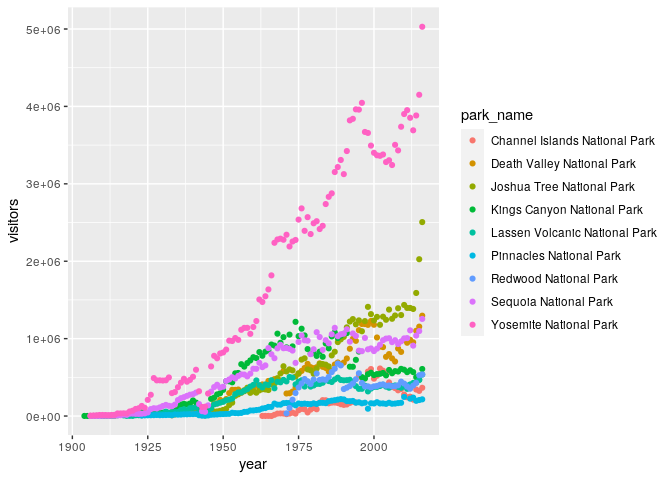<!-- -->

Bored?

  - There are specific functions for x, y, and title labels. Find them.
  - Find and try other themes.

## Faceting

data = se (Southeast US National Parks)

  - Scatter-plot `visitors` (y) by `year` (x) for the `se` dataset.
  - Add `facet_wrap(~ state)` to create a panel for each state.

<!-- end list -->

``` r
ggplot(se, aes(year, visitors)) +
  geom_point() +
  facet_wrap(~ state)
```

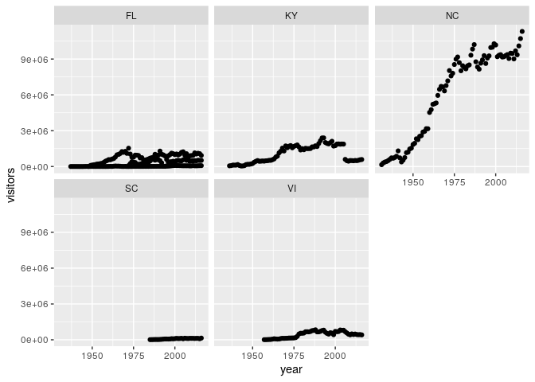<!-- -->

Bored?

  - What does the `scales` argument do?
  - Find another `face_*()` function.

## Geoms

### Discrete x

data = se

You can assign to a new variable part(s) of a ggplot and reuse them
later.

  - Why is this a poor plot?

<!-- end list -->

``` r
p <- ggplot(se, aes(park_name, visitors))
p + 
  geom_point()
```

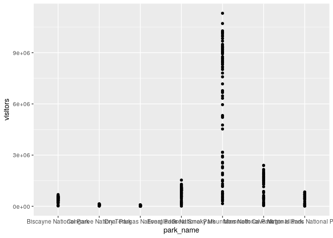<!-- -->

  - Change the opacity of the points with `alpha = 0.25`.
  - Here I also flip the coordinate system with `coord_flip()`
  - Is this a bit better?

<!-- end list -->

``` r
p + 
  geom_point(alpha = 0.25) +
  coord_flip()
```

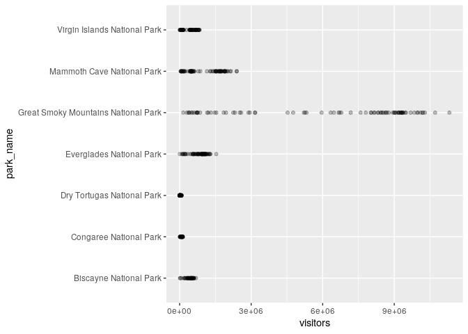<!-- -->

  - Here I use `geom_jitter()` instead of `geom_point()`.
  - Reorder the code so it runs correctly.

<!-- end list -->

``` r
p + coord_flip() + geom_jitter()
```

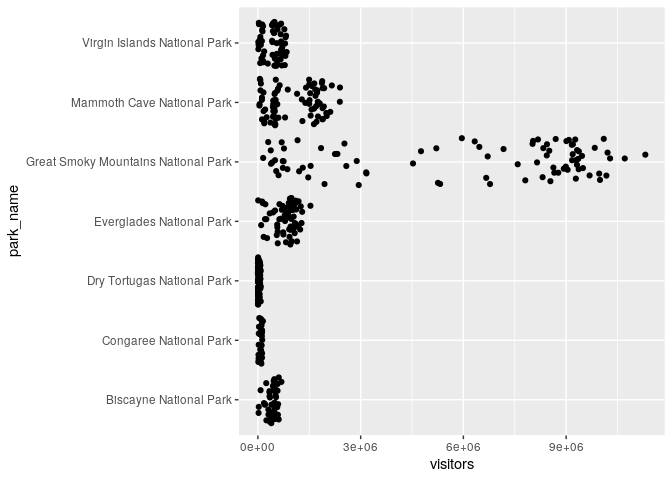<!-- -->

  - Create a boxplot.

<!-- end list -->

``` r
p + geom_boxplot() + coord_flip()
```

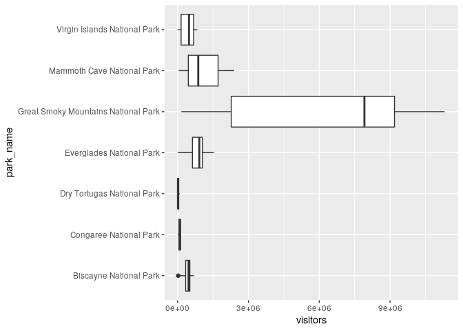<!-- -->

### Time series

data = acadia

  - Create a scatter plot
  - Add lines
  - Add a smoothed mean

<!-- end list -->

``` r
ggplot(acadia, aes(year, visitors)) + 
  geom_point() +
  geom_line() +
  geom_smooth()
#> `geom_smooth()` using method = 'loess' and formula 'y ~ x'
```

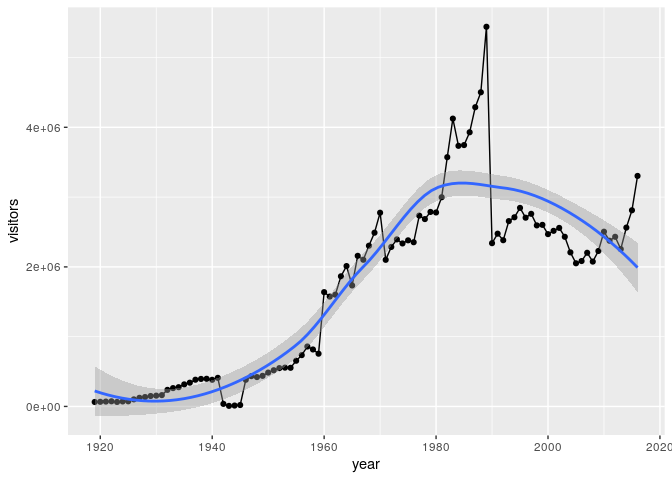<!-- -->

Bored?

  - Move the smoothed mean to become the second layer. What subtle thing
    happened?

### Bar charts

data = visit\_16

  - Create a columns bar chart where the height of the columns represent
    `visitors` (y) per `state` (x).

<!-- end list -->

``` r
ggplot(visit_16, aes(state, visitors)) + 
  geom_col()
```

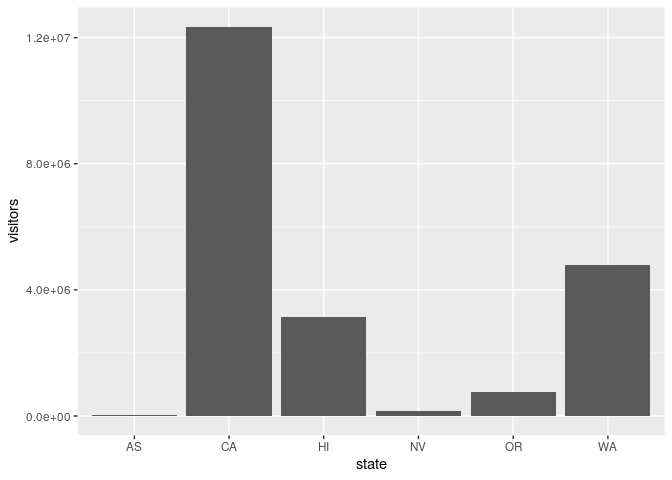<!-- -->

  - Map the bar fill to `park_name`.

<!-- end list -->

``` r
q <- ggplot(visit_16, aes(state, visitors, fill = park_name))
q + geom_col()
```

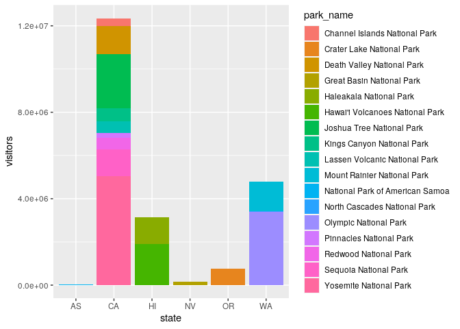<!-- -->

### Position adjustments

  - Now dodge the position of the bars to compare them side by side.

<!-- end list -->

``` r
my_plot <- q + geom_col(position = "dodge")
my_plot
```

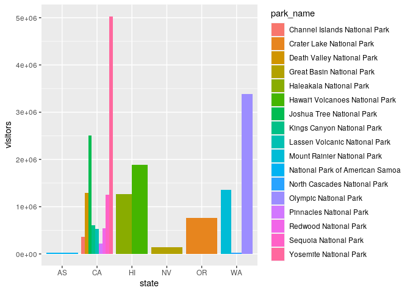<!-- -->

## Arranging and exporting plots

data = mass

  - Export `my_plot` with `ggsave()`.

<!-- end list -->

``` r
ggsave(filename = "03-my_plot.pdf", plot = my_plot)
#> Saving 7 x 5 in image
```

Bored?

  - Try to export a pdf with RStudio’s Viewer panel.

### ggplotly

  - Make `my_plot` interactive with the function `ggplotly()` of the
    package plotly .

<!-- end list -->

``` r
if (interactive()) {
  library(plotly)
  ggplotly(my_plot)
}
```

-----

# Take aways

You can use this code template to make thousands of graphs with
**ggplot2**.

``` r
ggplot(data = <DATA>) +
  <GEOM_FUNCTION>(mapping = aes(<MAPPINGS>))
```
